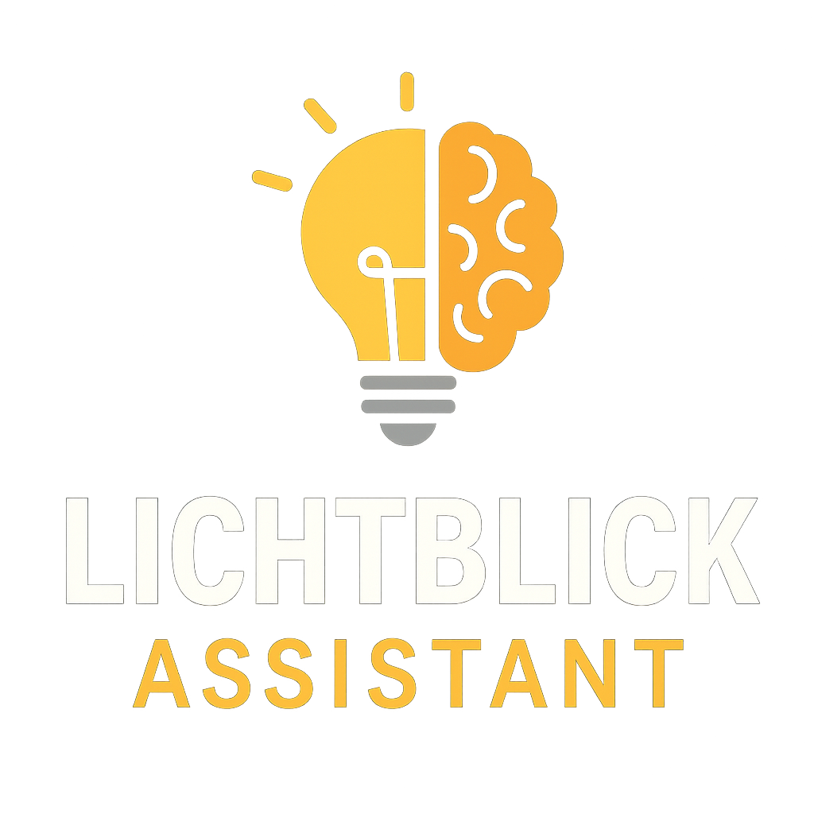
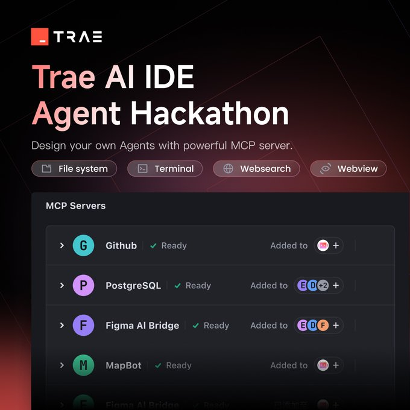

# Lichtblick German Learning Assistant 🇩🇪📚💡

An AI-powered German language learning assistant that provides intelligent sentence analysis, vocabulary extraction, and grammatical explanations. Built with Streamlit and OpenAI's language models using an agents-as-tools architecture.



## 🚀 Live Demo

Try the app: [lichtblick-german-assistant](https://huggingface.co/spaces/ashish-soni08/lichtblick-german-assistant)

## ✨ Features

- **Intelligent Sentence Analysis**: Get detailed word-by-word breakdowns with grammatical explanations
- **Vocabulary Extraction**: Extract German words with accurate English translations
- **Smart Agent Routing**: Automatically determines the best analysis approach for your input
- **Interactive Chat Interface**: Streamlit-powered conversational learning experience

## 🛠️ Technology Stack

- **Backend**: Python, OpenAI Agents SDK, OpenAI API
- **Frontend**: Streamlit
- **AI Architecture**: Multi-agent system built with OpenAI Agents SDK
- **Deployment**: Hugging Face Spaces

## 🏃‍♂️ Quick Start

### Prerequisites

```bash
Python 3.12.10 (CPython)
pip
```

### Installation

1. Clone the repository:
```bash
git clone https://github.com/Ashish-Soni08/Lichtblick.git
cd Lichtblick
```

2. Install dependencies:
```bash
pip install -r requirements.txt
```

3. **Configure API Key**: Enter your OpenAI API key in the app's sidebar when it loads

4. Run the application:
```bash
streamlit run app.py
```

5. Open your browser and navigate to `http://localhost:8501`

**For Hugging Face Spaces:** Simply visit the live demo link above - no local setup required!

## 📋 Usage

### Getting Started
1. **Enter API Key**: Add your OpenAI API key in the sidebar
2. **Ask Questions**: Type German words, phrases, or sentences in the chat
3. **Get Analysis**: Receive intelligent breakdowns and explanations

### Learning Modes

#### **Vocabulary Extraction**
Perfect for single words or short phrases:
```
Input: "der Hund"
Output:
der (->) the
Hund (->) dog
```

#### **Sentence Analysis** 
Detailed grammatical breakdown for full sentences:
```
Input: "Die Katze liegt auf dem Sofa."
Output:
The cat is lying on the sofa.
Die (->) the (feminine nominative singular definite article)
Katze (->) cat (feminine noun, nominative case)
liegt (->) is lying (third-person singular present tense of "liegen")
auf (->) on (preposition taking the dative case)
dem (->) the (masculine/neuter dative singular definite article)
Sofa (->) sofa (neuter noun, dative case)
```

### Example Interactions

**Vocabulary Help:**
- "What does 'gemütlich' mean?"
- "Translate 'Bahnhof'"

**Sentence Analysis:**
- "Analyze this: 'Ich gehe zur Schule.'"
- "Break down: 'Der Mann liest ein Buch.'"

## 🧠 AI Architecture

This app uses a **multi-agent system** with specialized capabilities:

- **Lichtblick Agent**: Main coordinator that routes requests to specialized agents
- **Vocabulary Agent**: Extracts German words and provides translations
- **Sentence Analysis Agent**: Performs detailed grammatical analysis and translations
- **Agent Framework**: OpenAI Agents SDK handles streaming responses and tool orchestration

## 📁 Project Structure

```
lichtblick/
├── .trae/                    # Trae IDE configuration
├── backend/                  # Backend agent logic
│   ├── __pycache__/         # Python cache files
│   ├── .german-ai-assistant/ # German AI assistant modules
│   ├── __init__.py          # Package initialization
│   └── lichtblick.py        # Main agent implementation
├── frontend/                 # Frontend interface
├── assets/                   # Static assets
│   ├── lichtblick_mascot.png # App mascot image
│   └── logo.png             # App logo
├── app.py                   # Main Streamlit application
├── setup.py                 # Package setup configuration
├── requirements.txt         # Python dependencies
├── LICENSE                  # Project license
├── README.md               # Project documentation
├── .env                    # Environment variables
├── .python-version         # Python version (3.12.10)
├── .gitignore             # Git ignore rules
└── vibe_coding_context/   # LLM context files
```

## 🎯 Learning Benefits

**For German Beginners:**
- **Clarity**: Word-by-word breakdowns make complex sentences understandable
- **Grammar Support**: Detailed explanations of cases, verb forms, and sentence structure
- **Interactive Learning**: Conversational interface encourages exploration
- **Personalized Help**: AI adapts responses based on your specific questions

## 🔑 Configuration

### Required Environment Variables
```bash
OPENAI_API_KEY=sk-your-openai-api-key-here
```

### Optional Settings
- Modify agent instructions in `backend.py`
- Customize UI elements in `app.py`
- Adjust context window (currently uses last 5 message turns)

## 📄 License

This project is licensed under the Apache License 2.0

## 🙏 Acknowledgments

- [OpenAI](https://openai.com/) for providing the language model APIs
- [Streamlit](https://streamlit.io/) for the web application framework
- [OpenAI Agents SDK](https://openai.github.io/openai-agents-python) for the multi-agent architecture

## 📞 Contact

Ashish Soni - ashish.soni2091@gmail.com

Project Link: [Lichtblick](https://github.com/Ashish-Soni08/Lichtblick)

## 🏆 **Built For**

This project was created for the **[Trae AI IDE Agent Hackathon](https://x.com/Trae_ai/status/1916747711933764033)** - a challenge to design custom agents using Trae's powerful MCP (Model Context Protocol) server capabilities. The hackathon encouraged developers to combine prompts, tools, and advanced agent architectures to create innovative AI applications.




## 🎯 **Inspiration & Background**

This project was inspired by **Andrej Karpathy's** insightful video ["How I use LLMs"](https://lnkd.in/eh23AVzn) (specifically the section from 1:59:00 - 2:04:40 where he discusses using custom GPTs for language learning). Following his approach, I created a specialized AI assistant for German language learning!

### **Evolution of Lichtblick:**
1. **Custom GPT Version**: Originally created as a [Custom GPT](https://chatgpt.com/g/g-67eb06db68b88191864b997a703bec21-lichtblick) with specialized prompts
2. **Multi-Agent Implementation**: Enhanced with OpenAI Agents SDK for more sophisticated tool routing
3. **Streamlit App**: Deployed as a full web application on Hugging Face Spaces

---

*Lichtblick* means "a glimmer of hope" or "ray of light" in German - representing the clarity this assistant brings to German language learning! ✨